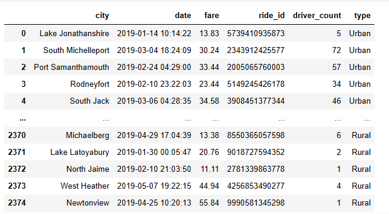
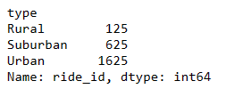
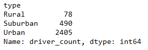
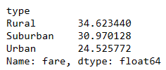
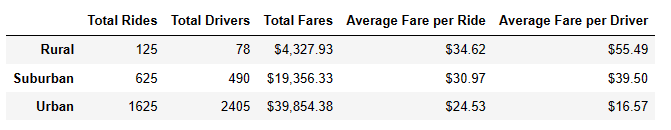
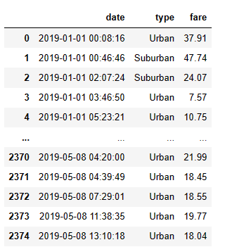
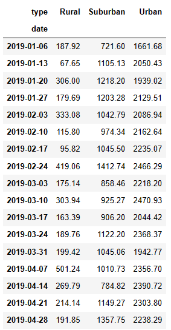
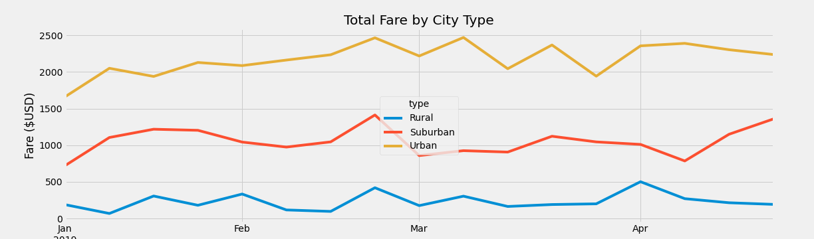

# PyBer Analysis with Matplotlib

## Overview of the PyBer analysis

### Background

Matplotlib is a plotting library for the Python programming language and its numerical mathematics extension NumPy. For this, this project was developed using the library to create a summary DataFrame of the ride-sharing data by city type. Then, using Pandas and Matplotlib, it will created a multiple-line graph that shows the total weekly fares for each city type. 

### Purpose

The main purpose of this project is provide an analysis on how the data differs by city type and how those differences can be used by decision-makers at PyBer. The analysis include the calculation of the metrics: total number of rides, total number of drivers, and the total fares for each city type. Then, calculation the average fare per ride and average fare per driver for each city type. Finally, add this data to a new DataFrame, then format the columns.

## Ride-sharing summary DataFrame by City Type - Results

Using the Pandas groupby() function the total number of rides, total number of drivers, and the total fares for each city type. For this a combination of the data into a single data set was created using the following code:

    pyber_data_df = pd.merge(ride_data_df, city_data_df, how="left", on=["city", "city"])
    pyber_data_df.head()

## Ride-Sharing Data Analysis - Results

First, it was necessary calculate the total rides for each city type using the code below. 
    
    total_ride_count = pyber_data_df.groupby(["type"]).count()["ride_id"]

In this way, a total of 2,375 rides were identified based on the following breakdown by type of city

With a total of 1,625 Urban rides as the most significat proportion between all types of cities

In the same way, the calculation for total drivers for each city type was created using the code 

    total_driver_count = city_data_df.groupby(["type"]).sum()["driver_count"] 

Obtaining the following results by each type city 

Obtaining 2,405 total drivers for Urban cities compared to just 78 for Rural areas.

The next metric include the average fare per ride for each city type, calculated using groupby()function as:

    average_fare_count = pyber_data_df.groupby(["type"]).mean()["fare"]

Obtaining the results below:

Where the lowest fare count is in the Yrban Area with an average of 24.52 compare to 34.62 for Rural and 30.97 for Suburban

To finally create a Pyber summary DataFrame, cleaning values to obtain the result as shows below:

With the most significat number of rides in Urban area with 1,625; havuing the lowest average fare per driver of $16.57, compare to 125 rides for an average of $55.49 at Rural Areas. In the same way, a Total Fare of $39,854.38 was collected for Urban Areas, while Suburban was $19,356.33 and Rural with almost 10 times less for Rural ($4,327.93)

This data was consolidated Using the code:

    pyber_summary_df = pd.DataFrame({
    "Total Rides": total_ride_count,
    "Total Drivers": total_driver_count,
    "Total Fares": total_fare_count,
    "Average Fare per Ride": average_fare_count,
    "Average Fare per Driver": average_fare_per_driver})

    pyber_summary_df["Total Fares"] = pyber_summary_df["Total Fares"].map("${:,.2f}".format)
    pyber_summary_df["Average Fare per Ride"] = pyber_summary_df["Average Fare per Ride"].map("${:,.2f}".format)
    pyber_summary_df["Average Fare per Driver"] = pyber_summary_df["Average Fare per Driver"].map("${:,.2f}".format)

After consolidate all the metrics the next step was create a multiple line plot to show the total weekly of the fares for each type of cities to ilustrate the analysis requested

## Multiline Plot Analysis - Results

In order to develop the Multiline Plot Analysis, the data was merged using the code 

    city_data_df = pd.read_csv(city_data_to_load)
    ride_data_df = pd.read_csv(ride_data_to_load)
    pyber_data_df = pd.merge(ride_data_df, city_data_df, how="left", on=["city", "city"])

Then Using groupby() to create a new DataFrame showing the sum of the fares for each date where the indices are the city type and date.

fare_by_date_type_df= pyber_data_df.groupby(["date","type"]).sum()[["fare"]]
fare_by_date_type_df

Also, it was required to reset the index on the DataFrame you created in #1. This is needed to use the 'pivot()' function.

    fare_by_date_type_df = fare_by_date_type_df.reset_index()
    fare_by_date_type_df

Obtaining the table as shows below for the fare by type and date 

The next step include create a pivot table with the 'date' as the index, the columns ='type', and values='fare' to get the total fares for each type of city by the date and create a new DataFrame from the pivot table DataFrame using loc on the given dates, '2019-01-01':'2019-04-29'

    fare_by_date_type_pivot = fare_by_date_type_df.pivot(index="date", columns= "type", values="fare")
    filtered_fare_by_date_type_pivot = fare_by_date_type_pivot.loc['2019-01-01':'2019-04-29']

To finally set the "date" index to datetime datatype. This is necessary to use the resample() method to obatain and using the function by week 'W' and getting the sum of the fares for each week to generate the following pivot table:

Finally, sing the object-oriented interface method, plot the resample DataFrame using the df.plot() function, using  the graph style fivethirtyeight:

    from matplotlib import style
    style.use('fivethirtyeight')
    import matplotlib.pyplot as plt
    filtered_fare_by_date_type_pivot.plot(figsize=(17, 5))
    plt.title("Total Fare by City Type")
    plt.ylabel("Fare ($USD)")

The final plot generate was the following graph wich was printed and saved in a specific location using the code :

    plt.savefig("analysis/PyBer_fare_summary.png")
    plt.show()

In this chart is possible identify the trends over time foir the Total fare by City Type, having Urban with the highest Fare over the time in yellow, while Rural Type has the lowest fare. In all three city types, it is possible identify a peak during the end of february, while Suburban trend to increase at the en of Q1 while Urban has a decrease.

In the same way, increment in fare for month of January are experienced for Urban and Suburban areas compared to rural. 

Finally, the lowest fare for Urban and Suburban is the begining of the year, while Rural tend to be at the end of Q1 based on the data collection for the period of time studied.  

## Summary - Recommendations

Identify possible reasons for changes at the end of Q1 in Suburban Areas, for example Holidays during that period of time could generate moving of people to specific areas which generate higher fare, giving an opportunity to Pyber to reallocate drivers based on the month of the year.

This graph demostrate the importance of the generetation of Data Visualization in order to describe and conclude. Graphic representation of data is a particularly efficient way of communicating when the data is numerous as for example the pivot table study which could generate more interesting graphs considering the Total Drivers, Total Rides or Average Fare per Ride and Driver over the time.

In this way, Pyber should develop further graphical analysis to study to number of drivers during the year to support possible movement of drivers based on customer needs for specific period of time in the year based on circunstance like weather, holidays, etc.

Additionally, based on the pivot table developed, it is important mentioned that the Average fare per Driver in Urban cities is around 40% less compare to Suburban cities, while the rides allocation is almost double in Urban cities compare to Suburban, being the tyoe of cities with the highest increment over the time in Q1 respect total fare, which represent some opportunities for Pyber to explore. 

### Conclusion 

In conclusion, data visualization is a powerful tool that can be develop using the resources in Matplotlib. This tools also represent a big opportunitty to Pyber to explore possible improvement in the process based on the 6 metrics studied over the time. Further significant difference could be observed between the types of cities including Urban, Suburban and Rural, using advatange of Data Visualization to obtain a clear idea of what the information means by giving it visual context through maps or graphs.
